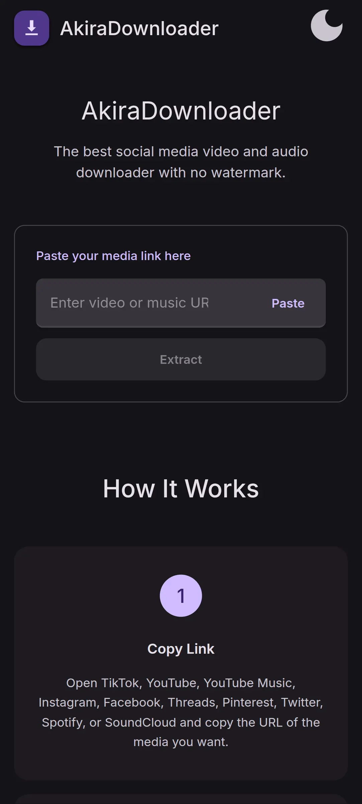
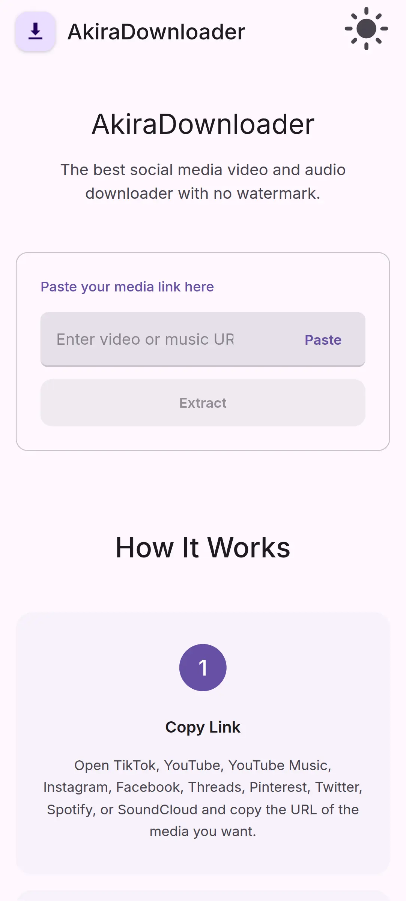
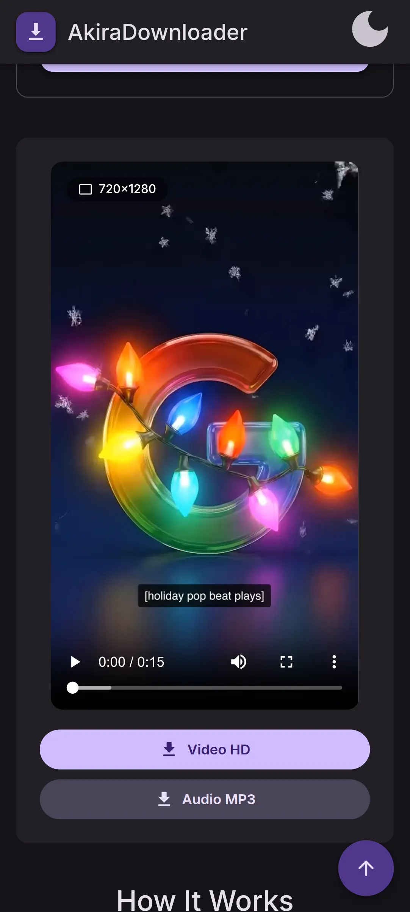
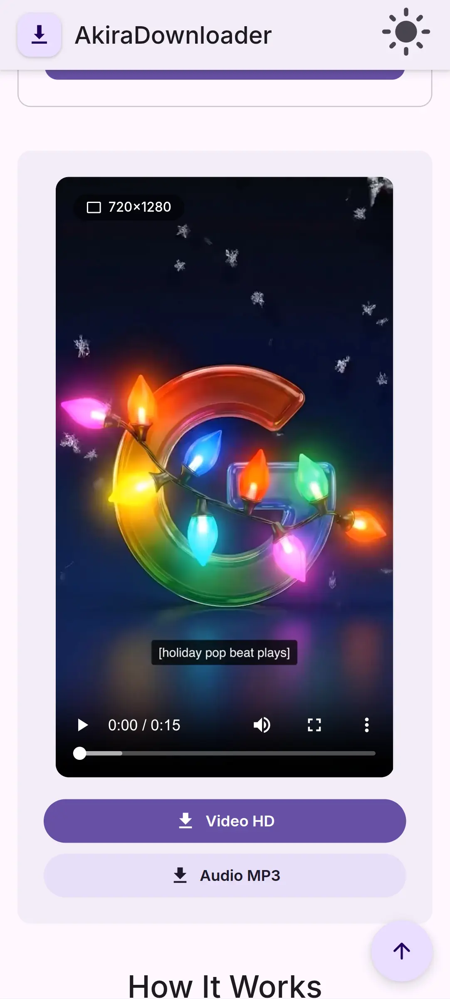
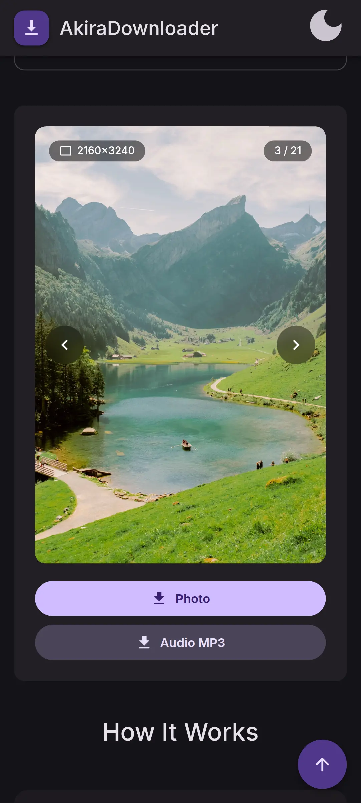
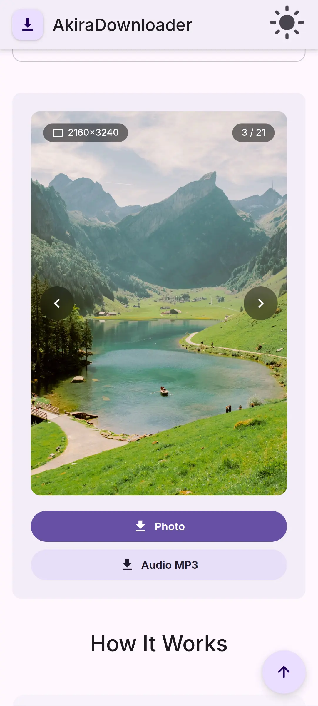
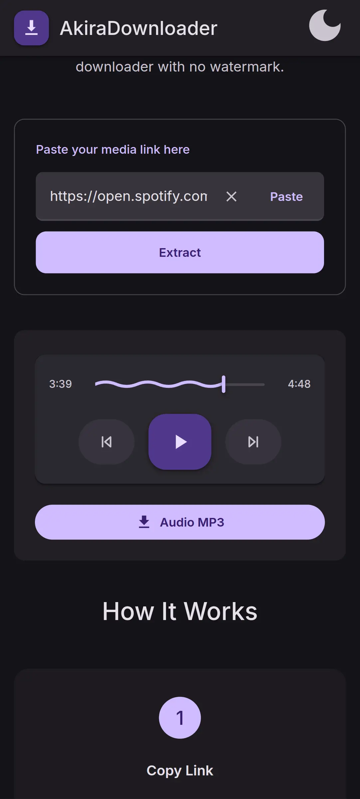
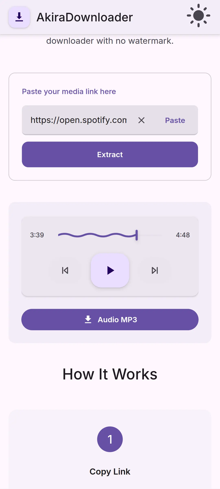

 

# AkiraDownloader

### The best social media video and audio downloader with no watermark.

## 📱 Screenshots

 

## 📖 Features

- **Multi-platform support** for TikTok, Instagram, YouTube, Facebook, Twitter (X), Threads, Pinterest, Spotify, and SoundCloud.

- **Watermark-free video downloads** for all supported platforms, providing clean files in the best available quality.

- **Standard audio extraction (MP3/M4A)** with high-bitrate support, perfect for saving music and clips for offline use.

- **In-app media previewer** to play videos and audio directly within the web interface before starting the download.

- **Hybrid Media Slider** for carousel posts, allowing users to browse and download multiple photos or videos from a single link.

- **No Login Required**, allowing users to access all downloading tools immediately without creating an account.

- **Fast URL processing** powered by an optimized backend with Axios Keep-Alive for reduced server response time.

- **Modern Material Design 3 layout** featuring a clean dark-mode interface and responsive design for all screen sizes.

- **Resolution indicators** that show whether the media is in HD or SD quality before the user clicks download.

- **Secure proxy-based media fetching** to bypass regional restrictions and ensure stable download links.

## 🌐 Access AkiraDownloader

To access the AkiraDowloader website, you can visit the website below. It is recommended to use a modern browser (Chrome, Firefox, etc.) for a more stable experience.

- Visit [AkiraDownloader](https://downloader.ditz.web.id/)

## 💬 Contact

Contact me via **[Telegram](https://t.me/akirashiroi)** and don't forget to join the **[AkiraProject Telegram Channel](https://t.me/akiraprojectofi)** to get information and notifications about other projects from AkiraProject.

## 📜 Credits & Acknowledgments

AkiraDownloader is built using several amazing open-source technologies and third-party services:

- **[NexRay API](https://api.nexray.web.id)** - Providing the powerful media extraction and downloading engine.
- **[Node.js](https://nodejs.org/) & [Express](https://expressjs.com/)** - Powering the robust and secure backend architecture.
- **[Better-SQLite3](https://github.com/WiseLibs/better-sqlite3)** - Handling lightning-fast data logging and security management.
- **[Telegraf](https://telegraf.js.org/)** - Enabling the integrated Telegram Admin Bot functionality.
- **[Vite](https://vitejs.dev/)** - Serving the high-performance frontend build and development environment.
- **[Material Design 3](https://m3.material.io/)** - Inspired the modern and dynamic UI/UX design system.
- **[Google Fonts](https://fonts.google.com/)** - Featuring the "Inter" typeface for a clean and readable interface.

 

> [!IMPORTANT]
>
> Please note that this is a **Documentation-only** repository. The actual source code of AkiraDownloader is **Closed Source** and is not available for cloning or redistribution.
